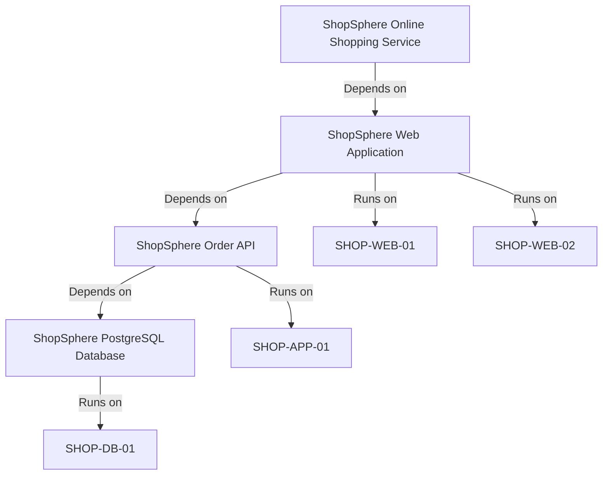
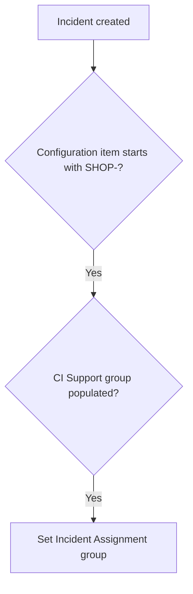

# ShopSphere CMDB Portfolio Project

A compact CMDB implementation that models an online shopping service from the customer-facing application service down to its supporting applications and Linux servers.

The project demonstrates practical CMDB skills including CI class selection, dependency modeling, Identification and Reconciliation Engine (IRE) ingestion, CMDB Health, ITSM impact analysis, Flow Designer automation, reporting, and portable deployment.

## Project overview

**Platform:**   Personal Developer Instance  
**Release used:** Australia  
**Implementation type:** Portfolio proof of concept  
**Scenario:** Online shopping application infrastructure

### Objectives

- Model an application service and its supporting technical components.
- Use standard CMDB classes instead of unnecessary custom tables.
- Define meaningful `Depends on::Used by` and `Runs on::Runs` relationships.
- Process server data through IRE and prevent duplicate CIs.
- Measure and remediate CMDB completeness issues.
- use CMDB ownership data to automate incident assignment.
- Demonstrate incident and change impact across the service topology.
- Package the implementation so it can be installed in another instance.

## Architecture



## CMDB data model

| Component |   class | Table | Quantity |
|---|---|---|---:|
| Application service | Mapped Application Service | `cmdb_ci_service_discovered` | 1 |
| Application components | Application | `cmdb_ci_appl` | 3 |
| Infrastructure | Linux Server | `cmdb_ci_linux_server` | 4 |
| CI relationships | CI Relationship | `cmdb_rel_ci` | 7 |
| Support ownership | User Group | `sys_user_group` | 1 |

### Configuration items

#### Application service

- ShopSphere Online Shopping Service

#### Applications

- ShopSphere Web Application
- ShopSphere Order API
- ShopSphere PostgreSQL Database

#### Linux servers

- `SHOP-WEB-01`
- `SHOP-WEB-02`
- `SHOP-APP-01`
- `SHOP-DB-01`

#### Support group

- ShopSphere Platform Support

## Relationship model

| Parent | Relationship | Child |
|---|---|---|
| ShopSphere Online Shopping Service | Depends on::Used by | ShopSphere Web Application |
| ShopSphere Web Application | Runs on::Runs | SHOP-WEB-01 |
| ShopSphere Web Application | Runs on::Runs | SHOP-WEB-02 |
| ShopSphere Web Application | Depends on::Used by | ShopSphere Order API |
| ShopSphere Order API | Runs on::Runs | SHOP-APP-01 |
| ShopSphere Order API | Depends on::Used by | ShopSphere PostgreSQL Database |
| ShopSphere PostgreSQL Database | Runs on::Runs | SHOP-DB-01 |

The model deliberately avoids a redundant direct relationship between the application service and Order API. The downstream dependency through the Web Application already represents that impact path.

## Implementation

### CMDB foundation and service mapping

- Created the ShopSphere support group.
- Created four Linux Server CIs with unique names, serial numbers, IP addresses, operational status, and support ownership.
- Created three Application CIs.
- Created a Mapped Application Service using the Manual population method.
- Added seven application-to-infrastructure relationships.
- Validated the complete topology using the Application Service Map and Dependency View.

### Import Sets and IRE

- Loaded server data into an Import Set staging table from CSV.
- Created a Transform Map targeting `cmdb_ci_linux_server`.
- Used an `onBefore` Transform Script to construct an IRE payload.
- Submitted each server through:

```javascript
sn_cmdb.IdentificationEngine.createOrUpdateCI(' ', input);
```

- Prevented a second Transform Map write with `ignore = true` after IRE processing.
- Reprocessed the same source data to demonstrate idempotency.
- Verified that existing Sys IDs remained unchanged and no duplicate servers were created.

### Health, ITSM and automation

- Configured recommended completeness fields for Linux Servers.
- Added a Health Inclusion Rule for Linux Servers whose names start with `SHOP-`.
- Introduced a controlled missing Support Group condition.
- Ran the completeness calculation, reviewed the failure, remediated the CI, and recalculated health.
- Created a Flow Designer flow that derives an Incident's Assignment Group from the selected CI's Support Group.
- Created a sample Incident against `SHOP-DB-01` and traced its upstream service impact.
- Created a Normal Change with affected ShopSphere CIs.
- Created operational CMDB reports and a portfolio dashboard.

## Automation

### ShopSphere Incident Assignment from CI

The flow runs when an Incident is created with a ShopSphere CI.



The Assignment Group is populated from:

```text
Incident → Configuration item → Support group
```

## CMDB Health

The Linux Server completeness configuration evaluates these recommended attributes:

- Name
- Serial number
- IP address
- Support group
- Operational status

The inclusion condition limits the demonstration to:

```text
Class = Linux Server
Name starts with SHOP-
Metric = Recommended
```

## Reports and dashboard

### Reports

1. ShopSphere CIs by Class
2. ShopSphere CI Operational Status
3. ShopSphere Incidents by Configuration Item

### Dashboard

- **Dashboard:** ShopSphere CMDB Portfolio Dashboard
- **Tab:** Overview

## Repository structure

```text
ShopSphere-CMDB-Portfolio/
├── README.md
├── update-set/
│   └── ShopSphere_CMDB_Portfolio_Update_Set.xml
├── cmdb-data/
│   ├── 01_ShopSphere_Support_Group.xml
│   ├── 02_ShopSphere_Linux_Servers.xml
│   ├── 03_ShopSphere_Applications.xml
│   ├── 04_ShopSphere_Application_Service.xml
│   └── 05_ShopSphere_CI_Relationships.xml
├── import-data/
│   └── ShopSphere_Day2_Server_Import.csv
└── screenshots/
    ├── 01-service-map.png
    ├── 02-linux-server-list.png
    ├── 03-identification-rule.png
    ├── 04-ire-transform-result.png
    ├── 05-health-before-remediation.png
    ├── 06-health-after-remediation.png
    ├── 07-incident-assignment.png
    ├── 08-flow-execution.png
    ├── 09-change-affected-cis.png
    └── 10-dashboard.png
```

## Installation

> Install this project only in a development or test instance. Review all XML and Update Set records before committing them.

### Prerequisites

-   instance with administrator access
- CMDB and Dependency View/Application Services available
- Flow Designer
- Incident and Change Management
- CMDB Health

### 1. Import the support group

1. Open `sys_user_group.list`.
2. Right-click the list header.
3. Select **Import XML**.
4. Import `01_ShopSphere_Support_Group.xml`.

Group membership is intentionally excluded because users and their Sys IDs differ between instances.

### 2. Import the CIs

Import the files in this order:

1. `02_ShopSphere_Linux_Servers.xml`
2. `03_ShopSphere_Applications.xml`
3. `04_ShopSphere_Application_Service.xml`

Use the corresponding target list for each file and select **Import XML** from the list-header menu.

### 3. Import the relationships

1. Open `cmdb_rel_ci.list`.
2. Select **Import XML**.
3. Import `05_ShopSphere_CI_Relationships.xml`.

Import relationships only after all parent and child CIs exist.

### 4. Install the Update Set

1. Navigate to **System Update Sets → Retrieved Update Sets**.
2. Select **Import Update Set from XML**.
3. Upload `ShopSphere_CMDB_Portfolio_Update_Set.xml`.
4. Open the retrieved Update Set.
5. Select **Preview Update Set**.
6. Review and resolve any preview problems.
7. Select **Commit Update Set**.

### 5. Validate the installation

Confirm:

| Validation | Expected result |
|---|---:|
| Linux Server CIs | 4 |
| Application CIs | 3 |
| Mapped Application Services | 1 |
| ShopSphere CI relationships | 7 |
| Duplicate serial numbers | 0 |
| Complete dependency chain | Yes |

### 6. Run the IRE demonstration

1. Load `ShopSphere_Day2_Server_Import.csv` into the ShopSphere staging table.
2. Run the ShopSphere IRE Transform Map.
3. Confirm the four existing Linux Servers are updated.
4. Run the same import again.
5. Confirm the server count remains four.

### 7. Validate operational automation

1. Confirm the Flow Designer flow is active.
2. Create an Incident with `SHOP-DB-01` as the Configuration Item.
3. Leave Assignment Group empty.
4. Confirm the flow assigns ShopSphere Platform Support.
5. Open Dependency View and trace impact to the application service.

## Post-install filters

### Linux Servers

```text
Shortcut: cmdb_ci_linux_server.list
Filter: Name starts with SHOP-
Expected: 4 records
```

### Applications

```text
Shortcut: cmdb_ci_appl.list
Filter: Name starts with ShopSphere
Expected: 3 records
```

### Application Service

```text
Shortcut: cmdb_ci_service_discovered.list
Filter: Name is ShopSphere Online Shopping Service
Expected: 1 record
```

### Relationships

```text
Shortcut: cmdb_rel_ci.list
Filter:
Parent.Name starts with ShopSphere
OR Parent.Name starts with SHOP-
OR Child.Name starts with ShopSphere
OR Child.Name starts with SHOP-
Expected: 7 records
```

## Evidence and screenshots


```markdown


```

Before publishing, remove or obscure:

- Instance URLs
- Usernames and email addresses
- Browser tabs containing unrelated client or personal information
- Sys IDs if you do not want them publicly exposed
- Any real organization or customer data

## Skills demonstrated

- CMDB class hierarchy and standard-class selection
- CSDM-aware application service modeling
- CI relationship direction and dependency mapping
- Import Sets and Transform Maps
- Identification and Reconciliation Engine scripting
- Duplicate prevention and idempotent ingestion
- CMDB Health completeness configuration
- Health Inclusion Rules and remediation
- Incident and Change integration with CMDB
- Flow Designer and CI-driven assignment
- Service impact analysis
- Reporting, dashboards and deployment packaging

## Design decisions

- Standard CMDB classes were used instead of custom CI tables.
- Serial numbers and names were populated to support CI identification.
- Application-to-server relationships use `Runs on::Runs`.
- Application dependencies use `Depends on::Used by`.
- The service topology avoids redundant relationships.
- IRE performs CI identification and update during ingestion.
- Health evaluation is limited to the portfolio CIs through an inclusion condition.
- Operational transaction data such as sample Incidents, Changes, Flow executions and health results is not transported.

## Limitations

- The project uses manually modeled service relationships rather than infrastructure Discovery.
- No MID Server or production credentials are included.
- Full top-down Service Mapping patterns are outside the scope of this PDI project.
- The project represents a controlled portfolio demonstration, not a production CMDB design.
- Application Service population metadata may require validation after XML import depending on installed plugins and instance release.

## Future enhancements

- Add a MID Server and credential-free Discovery lab.
- Replace the scripted import with IntegrationHub ETL or a Service Graph Connector pattern.
- Add reconciliation precedence rules for multiple simulated data sources.
- Configure stale and orphan CI health rules.
- Add service offerings and broader CSDM relationships.
- Add automated tests for CI counts, relationships and incident assignment.

## Author

**Rishita Mukherjee**  
  Developer / System Administrator

---

This project was created for learning and portfolio demonstration purposes using synthetic data in a Personal Developer Instance.
